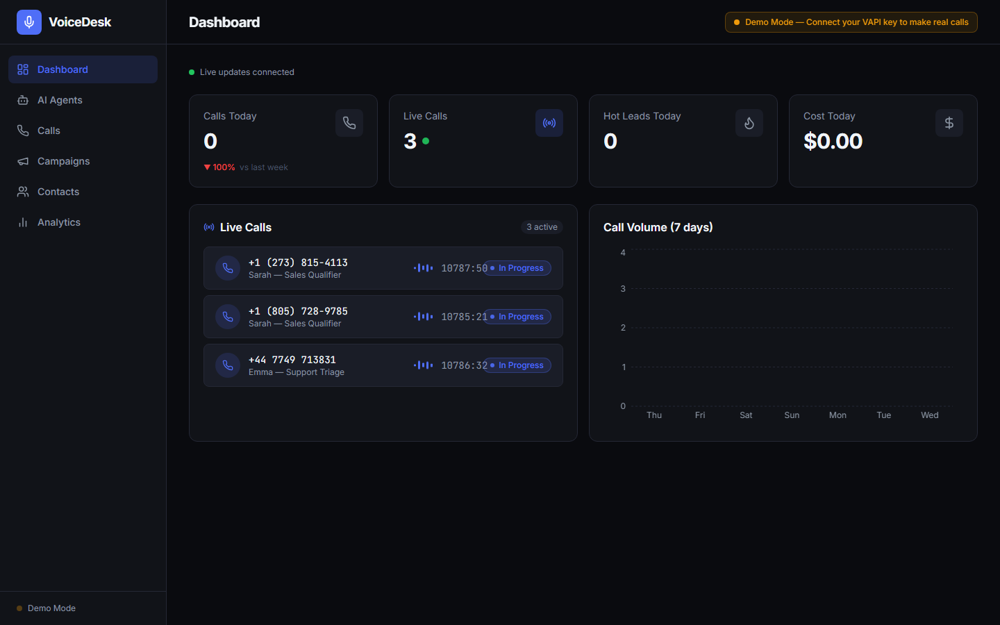

# 🎙️ VoiceDesk — AI Voice Agent Management Platform

A production-grade, full-stack platform for building, launching, and monitoring AI phone agents. Create voice agents, run inbound/outbound call campaigns, watch live calls in real time, and review transcripts, recordings, and AI-powered post-call analysis — all from one beautiful dashboard.

> Built to demonstrate end-to-end voice AI engineering with **VAPI**, **FastAPI**, **LangGraph**, **ElevenLabs**, and real-time call management.



> Dark, electric-blue dashboard — KPI cards (Total Calls · Connected Rate · Avg Duration · Qualified Leads), call-volume and sentiment-breakdown charts, and an agents panel with per-agent stats.

---

## ✨ Features

- **AI Agents** — Create voice agents with custom prompts, first messages, ElevenLabs voices, and temperature; synced to VAPI assistants.
- **Live Call Monitoring** — Near-real-time dashboard feed of in-progress calls with animated waveforms and live duration timers (via lightweight REST polling — serverless-friendly).
- **In-Browser Test Calls** — Talk to any agent directly in the browser using the VAPI Web SDK (microphone → live assistant).
- **Campaigns** — 3-step wizard to select an agent + contacts and launch batched outbound calling with configurable pacing (Vercel Cron).
- **Contacts** — Manual add + CSV import with status tracking (new → contacted → qualified → booked).
- **Transcripts & Analysis** — Chat-style transcript viewer, recording playback, lead score, intent, sentiment, objections, and recommended next action.
- **LangGraph Pipeline** — 4-node post-call analysis: sentiment → intent → lead score → recommended action.
- **Analytics** — Call volume, interest breakdown, success rate by agent, calls by hour, and cost trend charts.

---

## 🧰 Tech Stack

**Backend:** Python 3.11 · FastAPI · SQLAlchemy (async — Postgres/asyncpg in prod, SQLite locally) · LangGraph · Vercel Cron · httpx · VAPI REST API · Vercel Python serverless

**Frontend:** Next.js 14 (App Router) · TypeScript · Tailwind CSS · Recharts · Framer Motion · Lucide · @vapi-ai/web

---

## 🚀 Quick Start

### 1. Backend

```bash
cd backend
python -m venv .venv
# Windows: .\.venv\Scripts\Activate.ps1   |   macOS/Linux: source .venv/bin/activate
pip install -r requirements.txt
cp .env.example .env          # then fill in your VAPI + Gemini keys
uvicorn main:app --reload --port 8000
```

The API starts on **http://localhost:8000** and auto-creates an empty SQLite DB on first run (locally; production uses Postgres). On startup it logs a warning if any required key (`VAPI_PRIVATE_KEY`, `GOOGLE_API_KEY`) or the phone number is missing.

### 2. Frontend

```bash
cd frontend
npm install
# .env.local already points at http://localhost:8000
npm run dev
```

Open **http://localhost:3000** → you'll be redirected to the dashboard.

> On Windows you can also use the helper scripts: `backend/start.ps1` and `npm run dev` in `frontend/`.

### 3–5. Explore

3. **Agents → New** — create an agent; it's synced to a real VAPI assistant automatically.
4. **Agents** → open one → **Start Test Call** — talk to it live in your browser via the mic.
5. **Campaigns → New** — build a campaign and hit *Launch* to place real outbound calls (requires a VAPI phone number).

---

## 🏗️ Architecture

```
┌──────────────────────────────┐      REST polling (live)       ┌───────────────────────────┐
│   Next.js 14 Frontend        │ ◄──────every few seconds───────►│  FastAPI Backend (Vercel)  │
│   (Vercel)                   │                                │                            │
│  Dashboard · Agents · Calls  │ ───────REST /api/* ──────────► │  Routers ─► Services ─► DB  │
│  Campaigns · Contacts · A/n  │                                │   │           │            │
└──────────────┬───────────────┘                                │   │           ├─ VAPI client (httpx)
               │ @vapi-ai/web (browser call)                    │   │           ├─ LangGraph pipeline
               ▼                                                 │   │           └─ Vercel Cron ─► batches
        ┌─────────────┐         webhooks (/api/webhooks/vapi)   │   ▼
        │    VAPI      │ ──────────────────────────────────────►│  Vercel Postgres (asyncpg)
        │  (telephony) │   status · transcript · end-of-call    │
        └─────────────┘                                         └───────────────────────────┘
```

**Post-call flow:** VAPI `end-of-call-report` → webhook persists transcript/cost/recording → runs the LangGraph pipeline inline (sentiment → intent → lead score → next action) and saves the analysis → the dashboard picks it up on its next poll.

---

## 📞 VAPI Setup

1. Create an account at [dashboard.vapi.ai](https://dashboard.vapi.ai) and copy your **Private** and **Public** API keys.
2. **Register provider credentials in your VAPI org** so the live assistant can use them (Dashboard → Providers, or via the API):
   - **Google (Gemini)** — the assistant's LLM (`gemini-2.5-flash`).
   - **ElevenLabs** — the assistant's voice.
   > Your backend `GOOGLE_API_KEY` only powers the post-call analysis pipeline. VAPI runs the *live* assistant on its own infra, so those keys must also be registered inside VAPI.
3. For **outbound phone calls / campaigns**: buy or import a phone number in VAPI and copy its **Phone Number ID** into `VAPI_PHONE_NUMBER_ID`. (In-browser web calls don't need a number.)
4. Fill the keys into `backend/.env` and set `NEXT_PUBLIC_VAPI_PUBLIC_KEY` in `frontend/.env.local`.
5. Set `BACKEND_URL` to a **public** URL so VAPI can reach `/api/webhooks/vapi` (use `ngrok http 8000` locally, or your deployed URL in production). localhost is not reachable by VAPI.
6. Restart the backend — agents you create sync to real VAPI assistants, "Test Call" runs a live browser call, and campaigns place real outbound calls.

---

## ✅ Production Checklist (Vercel)

- [ ] Backend Vercel project: **Root Directory = `backend`**; Postgres added (or `DATABASE_URL` set)
- [ ] Backend env: `VAPI_PRIVATE_KEY`, `VAPI_PUBLIC_KEY`, `GOOGLE_API_KEY`, `ELEVENLABS_API_KEY`
- [ ] Backend env: `BACKEND_URL` = the backend's own Vercel URL (for VAPI webhooks)
- [ ] Backend env: `FRONTEND_URL` = the frontend's Vercel URL; `CRON_SECRET` set to a strong random value
- [ ] Google + ElevenLabs credentials registered **in the VAPI org**
- [ ] `VAPI_PHONE_NUMBER_ID` set (only if using outbound phone calls/campaigns)
- [ ] Frontend Vercel project: **Root Directory = `frontend`**; `NEXT_PUBLIC_API_URL` = backend URL, `NEXT_PUBLIC_VAPI_PUBLIC_KEY` set
- [ ] `GET /api/settings` on the backend returns `vapi_connected: true`

The app starts with an empty database — create your own agents and contacts. There is no demo/seed data.

---

## 🌐 Deployment (both on Vercel)

The backend and frontend deploy as **two separate Vercel projects** from the same repo.

### Backend → Vercel (Python serverless)

1. **Add New → Project**, import the repo, set **Root Directory** to `backend`.
   Vercel auto-detects `backend/vercel.json` and the `api/index.py` entrypoint.
2. **Storage → Create → Postgres** (Vercel Postgres / Neon). This injects
   `POSTGRES_URL` / `POSTGRES_URL_NON_POOLING` automatically — no `DATABASE_URL`
   needed. (Or set `DATABASE_URL` for an external Postgres.)
3. Add env vars: `VAPI_PRIVATE_KEY`, `VAPI_PUBLIC_KEY`, `GOOGLE_API_KEY`,
   `ELEVENLABS_API_KEY`, `VAPI_PHONE_NUMBER_ID` (optional), `FRONTEND_URL`,
   `BACKEND_URL` (this project's own URL), and `CRON_SECRET` (any strong random
   string — guards the campaign cron endpoint).
4. Deploy. Tables are created on the first request; a Vercel Cron job
   (`*/2 * * * *`) paces outbound campaigns automatically.

### Frontend → Vercel

1. Add a second project from the same repo, set **Root Directory** to `frontend`.
2. Add env vars:
   - `NEXT_PUBLIC_API_URL` = your backend Vercel URL (e.g. `https://your-api.vercel.app`)
   - `NEXT_PUBLIC_VAPI_PUBLIC_KEY` = your VAPI public key
3. Deploy.

> **Serverless architecture:** Vercel functions are stateless and can't hold
> WebSockets open or run background schedulers, so this app uses **REST polling**
> for live updates (no WebSocket), **Vercel Cron** for campaign pacing, and
> **Vercel Postgres** for state (not SQLite). The two projects are cross-origin;
> the backend allows the frontend via CORS (`FRONTEND_URL` + any `*.vercel.app`).

---

## 📁 Project Structure

```
voicedesk/
├── backend/    FastAPI · models · schemas · routers · services (VAPI, LangGraph, scheduler) · ws
└── frontend/   Next.js App Router · components (layout, dashboard, agents, calls, campaigns, voice, shared) · lib · types
```

---

## 📄 License

MIT
